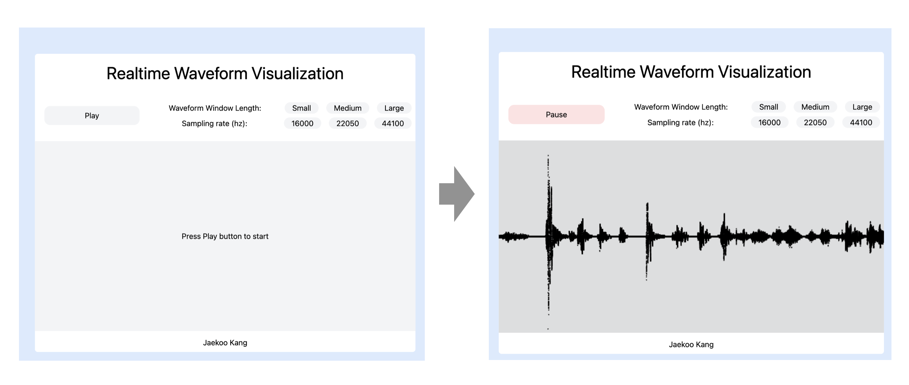

# React Audio Waveform

Status: in-progress

## Demo: https://react-waveform.netlify.app/

- Reference:
    - https://github.com/philnash/react-web-audio (blog: https://www.twilio.com/blog/audio-visualisation-web-audio-api--react)
    

---
- 2024-12-10 jkang first created
- 2024-12-11 Waveform.jsx working
    - Sampling rate: 48000, Frequency bins: 2024, Time domain: 1024 samples => window size: 2048, roughly 42.6 ms
- 2024-12-12 Visualizer.jsx working (using cursor ai)
- 2024-12-16 sampling rate
    - [x] issue: incompatiblity between Uint8Array and Float32Array => needs fixing
    - [x] fixed the css issue
        - TODO: check why className is not dynamically updated when used with {`min-w-[${panelMinWidth}px]`}. It worked for a while then suddenly stopped working.
        - TODO: Refactor the code. Currently, it is messy.